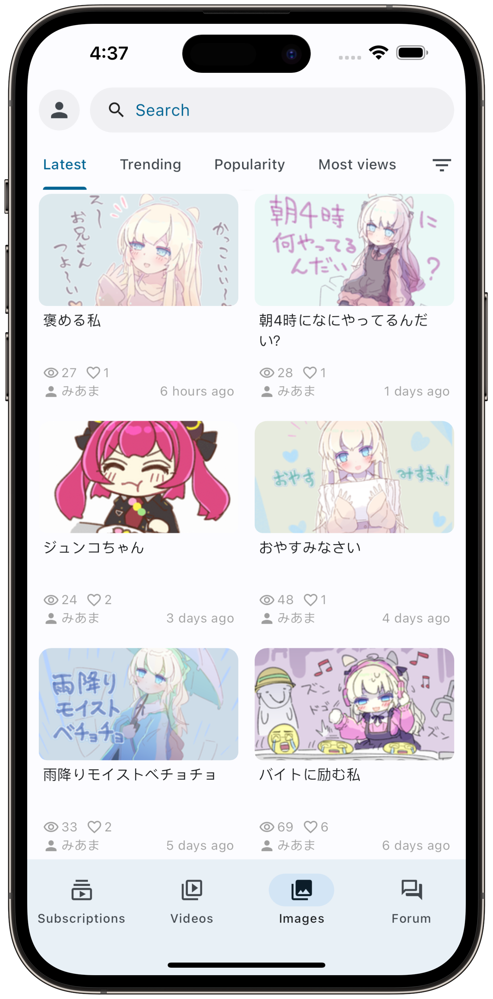
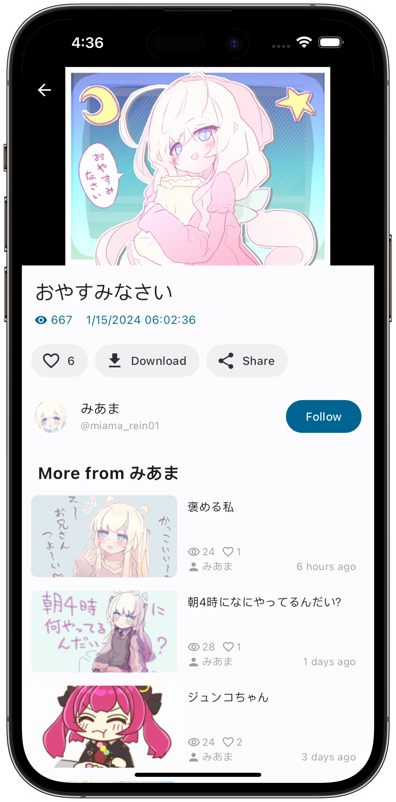
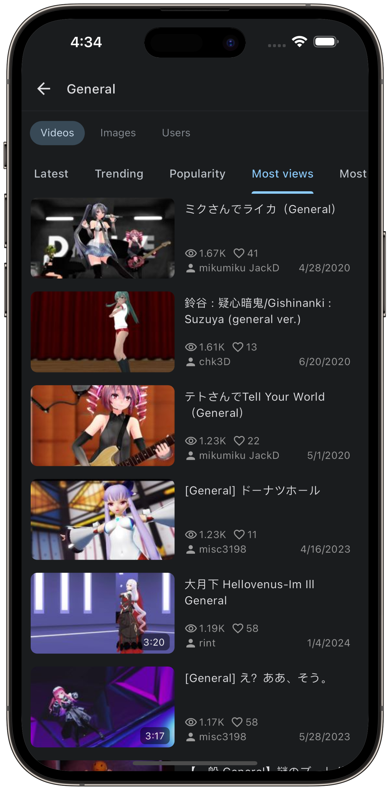

# IwrQk

简体中文 | [English](./README.en.md)

IwrQk 是一款基于 Flutter 的 Android 应用，适配新版 Iwara（一个视频分享平台）。

现已支持 [Material Design 3](https://m3.material.io/)。

## 📌 项目来源

本项目是 [iwrqk/iwrqk](https://github.com/iwrqk/iwrqk)（已归档，不再维护）的延续开发版本，并沿用 [GPL-3.0](./LICENSE) 开源协议。

**目前只维护 Android 版，不提供 iOS 版。** Windows、macOS、Linux 仍沿用原项目的代码，尚未同步更新和测试。

## 📥 下载

在 [Releases](https://github.com/Sinon2003/iwrqk/releases) 下载 APK：

- 大多数手机：`iwrqk-版本号-arm64-v8a.apk`
- 较旧的 32 位手机：`iwrqk-版本号-armeabi-v7a.apk`
- 不确定时：`iwrqk-版本号-universal.apk`（通用，体积更大）

安装后可在「系统设置 → 检查更新」里直接下载并安装新版本。

## 🚩 功能

- ✅ 视频播放与图集浏览，可设置默认清晰度（自动 / 画质优先 / 流畅优先 / 指定）
- ✅ 下载管理（仅支持视频），实验性的加速下载与播放
- ✅ 关注、订阅、收藏、播放列表、评论
- ✅ 论坛
- ✅ 通知与私信
- ✅ 好友管理
- ✅ 账号设置：头像、背景图、昵称、简介、内容偏好、通知设置
- ✅ 标签屏蔽，会员可屏蔽用户
- ✅ 观看记录：云端（随账号同步）与本机
- ✅ 翻译视频简介、评论和帖子（Google、火山、腾讯交互翻译、Yandex）
- ✅ 登录、退出登录、注册
- ✅ 应用内检查并安装更新
- ⬜ 高级搜索

## 📱 截图

|  |  |  |
| :------------------: | :------------------: | :------------------: |

## 💻 参与贡献

如果你是开发者并且愿意参与贡献，欢迎提交 Pull Request！项目使用 `slang` 进行多语言本地化，也欢迎[参与翻译](/lib/i18n/strings.i18n.json)。

遇到 Bug 时，请先确认不是网络问题导致的再反馈，因为 Iwara 的服务器本身也可能出错。

让我们一起打造更好的 Iwara 使用体验！

特别感谢 [guozhigq/pilipala](https://github.com/guozhigq/pilipala) 提供的灵感和播放器实现。

## 📄 开源协议

IwrQk 是免费的开源软件，基于 [GPL-3.0](./LICENSE) 协议发布，任何人都可以自由使用。修改或再分发时，也必须以 GPL-3.0 协议开源。
