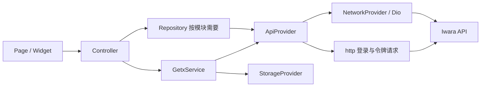

# 架构与数据流

[返回开发原则](../../AGENTS.md) · [目录地图](project-structure.md)

本文描述当前实现及维护时需要保留的行为约定。仓库采用按功能分组的 GetX 结构，各模块的分层深度并不完全一致。

## 启动与依赖

[main.dart](../../lib/main.dart) 的顺序是：

1. 初始化 Flutter binding 和 `MediaKit`。
2. 初始化 `PathUtil` → `StorageProvider` → `LogUtil`，再设置代理、音频服务和 `ConfigProvider`。
3. 调用 [initGetx()](../../lib/getx.dart) 注册配置、Discord RPC、账号、下载、预览、用户服务，以及共享对话框控制器。
4. 设置屏幕方向、系统栏、语言；桌面端初始化窗口。
5. 用 `TranslationProvider` 包裹 `MainApp`，由 `GetMaterialApp` 加载主题和路由，初始路由为 splash。

[SplashController](../../lib/app/modules/splash/controller.dart) 处理规则确认、缓存登录与用户初始化，随后进入首页或登录页。初始化顺序存在依赖：例如日志依赖路径和存储，网络令牌拦截器通过 `Get.find()` 获取 `AccountService`。

全局服务使用 `Get.put`；页面通常由 Binding 使用 `Get.lazyPut`，媒体详情等使用 `Get.create`。列表、评论等多实例组件使用 tag 区分。调整注册方式时检查实例的拥有者、获取位置和释放时机。

## 页面与数据访问

- 页面渲染状态、转发交互；controller 组织页面状态和业务流程。常见 `Rx` 字段、getter / setter、`Obx`，列表还使用 `StateMixin`。
- repository 位于使用它的模块或组件旁边，组装查询并转换返回值；简单模块也会由 controller 直接调用 service 或 provider，无需为了层数补空壳。
- [ApiResult / GroupResult](../../lib/app/data/enums/result.dart) 表达请求结果和带总数的列表；模型使用手写 `fromJson` / `toJson`。
- [IwrRefreshController](../../lib/app/components/iwr_refresh/controller.dart) 集中处理刷新、页码、登录要求及加载状态，子类实现 `getNewData()`。其 UI 状态还依赖 `state` 字段中的 `loading`、`empty`、`fail`、`requireLogin`，不能只根据 `RxStatus` 判断。

可沿 [MediaPreviewGridController](../../lib/app/components/media_preview/media_preview_grid/controller.dart) → 同目录 repository → `ApiProvider.getMedia()` 阅读一个完整列表链路。

## 网络与会话

[NetworkProvider](../../lib/app/data/providers/network/network_provider.dart) 是 Dio 单例，配置超时、Cookie、Cloudflare 和令牌拦截器。`MainApp.build()` 为它提供 `BuildContext`，用于配置 Cloudflare 拦截器。

[RefreshTokenInterceptor](../../lib/app/data/providers/network/refresh_token_interceptor.dart) 添加授权头，遇到 401 或访问令牌过期时通过队列刷新并重发请求。[AccountService](../../lib/app/data/services/account_service.dart) 管理持久令牌、内存访问令牌和登录状态；用户资料及用户相关操作由 [UserService](../../lib/app/data/services/user_service.dart) 管理。

修改网络代码前注意这些现状：

- `ApiProvider.login()` 和 `getAccessToken()` 直接使用 `package:http`，绕开上述 Dio 拦截链；代码保留了兼容性说明，统一客户端前要验证登录、过期刷新和失败重试。
- `NetworkProvider` 接受小于 500 的 HTTP 状态，业务失败仍需检查响应状态、响应体及 `ApiResult.success`。
- GET / POST 的完整 URL 方法会转换部分 HTML 包裹的 JSON，并根据设置添加 `X-Site`；PUT / DELETE 没有同样的处理。站点切换修复要检查各请求路径，不能假设行为一致。
- 内容翻译由 [TranslateProvider](../../lib/app/data/providers/translate_provider.dart) 调用免 Key 的网页翻译接口，翻译源见 [TranslationEngine](../../lib/app/data/enums/translation_engine.dart)（Google、火山、腾讯交互翻译、Yandex）。目标语言跟随 App 语言并按各源映射；长文本按行切分，每个源有各自的单次上限。这些都是非官方接口，可能随时变化，失败时提示并写日志。默认源、启用列表与显示方式（替换原文或显示在原文下方，默认替换）存于 `ConfigService`，默认源始终处于启用状态。界面状态由 [TranslationMixin](../../lib/app/components/translation_mixin.dart) 管理：按源缓存、收起与展开（替换模式下为显示原文）、换源；译文由 [TranslatedContent](../../lib/app/components/translated_content.dart) 显示。视频简介、评论、论坛帖子共用这一套。
- 应用内更新由 [UpdateService](../../lib/app/data/services/update_service.dart) 负责。更新地址在 [const/config.dart](../../lib/app/const/config.dart)，指向本仓库 `Sinon2003/iwrqk` 的 GitHub Releases。[ConfigProvider](../../lib/app/data/providers/config_provider.dart) 取列表第一项（预发布版本也算），去掉标签的 `v` 后按段比较整数，所以发布标签须为 `vX.Y.Z` 纯数字格式；没有任何 Release 时提示检查失败。
    - 有新版时按设备支持的 ABI 找附件 `iwrqk-<版本>-<ABI>.apk`，找不到再用 `iwrqk-<版本>-universal.apk`，都没有才打开 Release 页面。发布时附件须保持这个命名。
    - APK 用 Dio 下载到临时目录（沿用应用代理），核对大小后用 `open_file` 调起系统安装器覆盖安装；应用不在前台时等回到前台再调起。manifest 为此声明 `REQUEST_INSTALL_PACKAGES`，首次安装要用户允许"安装未知应用"。

## 存储与配置

[StorageProvider](../../lib/app/data/providers/storage_provider.dart) 统一封装两类存储：

| 内容 | 实现 |
| --- | --- |
| 配置、浏览 / 搜索历史、视频下载记录 | `GetStorage`，经 `GStorageConfig` / `GStorageRecord` 编码为 JSON |
| 用户令牌、保存的账号密码、锁屏配置 | `FlutterSecureStorage`，经 `SecStorageObject` / `SecStorageMap` 访问 |

[ConfigService](../../lib/app/data/services/config_service.dart) 将部分设置映射为响应式状态；持久化键分布在 `StorageKey`、`PLPlayerConfigKey`、`ConfigKey` 和 `DynamicConfigKey`。例如 `accpetedRules` 是现有存储键，修正拼写需要同时设计旧数据读取或迁移。

历史和下载模型在 `data/models/offline/` 及 `data/models/download_task.dart`。修改模型要检查缓存 JSON 和重启后的恢复路径，而不只检查新 API 响应。

## 播放、下载与平台行为

- 在线视频的清晰度由 [QualityPicker](../../lib/app/utils/quality_picker.dart) 在打开视频时选择：画质优先、流畅优先、指定清晰度（没有就选低一档）或自动。自动模式用吞吐的七成作预算；Source 优先按 API 已返回的 `file.size × 8 / duration` 计算平均码率，其他档位缺少大小时采用经验值。无有效观测时用 2.5 Mbps 初始预算，通常从 540 开始。没有测速下载、逐档 HEAD 探测或播放中自动换源，手动选择仍只影响当前视频。
    - [PlaybackMonitor](../../lib/app/components/plugin/pl_player/utils/playback_monitor.dart) 每秒读取本机状态，最多 12 次；用至少两个有效窗口中的次高值，过滤单个尖峰。检测到缓存空闲或接近时间 / 字节上限时立即结算；不能把缓存填满后的补充速率当成线路容量。普通播放读取 mpv 的 `cache-speed`；加速播放读取代理按上游实际到达字节计算的独立窗口，包含请求 / 重试等待，不减去下游等待，不采 localhost 突发速度，也不重复计入同一窗口。
    - [PlaybackBandwidth](../../lib/app/utils/playback_bandwidth.dart) 按 CDN 主机和加速模式记录，最多保留 8 项，5 分钟过期；Iwara 会轮换各档 CDN，未观测的主机参考同模式最新观测的八成，已有该主机观测则优先使用（慢主机不会被其他主机的高速记录覆盖）。新版本使用 `playbackBandwidth` 结构，旧 `playbackThroughput` 数字不再参与决策。外部 VPN 节点变化无法直接感知，新的播放观测和持续卡顿反馈会修正估计。样本不足时保留保守起始档位，不追加测速。
    - 持续缓冲至少 2 秒且没有可播放缓存才下调后续视频的预算；首播、暂停、结束和跳转后 3 秒内的等待不算卡顿。先结算旧样本再降低估计，避免随后被旧数据覆盖；换源前销毁旧监控，回调固定捕获当时的源和模式。
- [媒体详情](../../lib/app/modules/media_detail/controller.dart) 负责在线 / 离线媒体加载、清晰度、收藏、历史和播放入口，并像网页端一样记录播放过的 1/16 段，离开页面时上报观看（`POST video/{id}/view`），这也构成网站端的观看记录；[pl_player](../../lib/app/components/plugin/pl_player/controller.dart) 基于 `media_kit` 管理播放器、控制栏、流订阅和定时器，音频会话在 `data/services/plugin/pl_player/`。
- Android 画中画使用 `floating`；Windows 画中画在媒体详情中通过 `window_manager` 调整并恢复窗口。退出详情、全屏切换、前后台切换都涉及资源生命周期。
- [DownloadService](../../lib/app/data/services/download_service.dart) 使用 `background_downloader`，注册顶层状态 / 进度回调，并维护任务状态与持久记录。回调带有 `@pragma('vm:entry-point')`；修改下载逻辑时检查后台回调、权限、路径和任务恢复。下载按文件路径写入用户选择的目录：Android 11+ 依赖 `MANAGE_EXTERNAL_STORAGE`，Android 10 依赖 manifest 中的 `requestLegacyExternalStorage`；目录选择不能改用返回 `content://` 的 SAF 方式。删除下载统一走 `DownloadService.removeTask`：先取消任务，等下载器把取消写进它的记录，再删记录和文件；记录删得太早会被随后到达的状态更新写回，只删记录不取消则任务会在后台继续下载。
- 实验性"加速下载与播放"（`ConfigService.acceleratedTransfer`，默认关）由 [ParallelRangeProxy](../../lib/app/utils/parallel_range_proxy.dart) 实现，在 127.0.0.1 为播放器与下载器提供可 seek 的 HTTP 文件。先发送一个连续 Range 请求，同时取得大小和正文，GET 不再额外探测文件长度。上游不支持 Range 时按原状态流式转发；本机 HEAD 则通过单字节 GET 获得大小，以兼容拒绝 HEAD 的文件服务器。
    - 连续传输至少采样 3 秒且收到 512 KiB 后，才考虑并行；小文件或剩余数据不足两段时保持单流。段大小按约 2 秒的数据量选择，生产范围 1–4 MiB，先试两路，有收益再增至最多四路。吞吐低于原单流的 115%，或明显低于上一轮时，停止分段，从已交付偏移继续单流。每个读取方保留自己的普通连接；同一主机只共享最多三条额外预取连接，拿不到名额就继续原单流，不排队等其他下载结束。预取段在尚未有监听者时仍会接收，最多约三段 / 12 MiB 的额外内存。
    - 播放器传入媒体时长，代理结合所选文件实际大小估算平均码率；单流已达到其 1.5 倍时跳过试探。策略针对当前传输重新判断，不持久化某个 VPN 节点的带宽假设，也不修改 Clash / NekoBox 设置。总带宽已满时，并行不保证提速。
    - 每段核对 `206`、`Content-Range` 的起止位置和总长、声明长度及已有 ETag；有强 ETag 时续传附带 `If-Range`，下载器原有的 `If-Range` 也透传，上游文件改变时保留其 `200` 完整响应，不能将新内容误接到旧文件后。超时或截断按已收到字节重试，只累计连续无进展的失败（最多三次），收到新字节就重置额度；校验失败会关闭响应，不把错误分段当成功文件。连接建立与响应头共用 10 秒预算，正文停滞看门狗为 5 秒；读取方断开或半关闭时取消请求并释放本机连接，读取方背压时暂停取数和正文看门狗。
    - 本机地址内含上游 URL，端口固定为 38291（被占用时换随机端口）。`DownloadService` 启动时若有未完成的加速任务会先启动代理，恢复 / 重试时按当前端口改写任务地址。
    - 开关在创建播放源和下载任务时读取；已有下载任务保留原 URL，开关不会自动切换正在进行的传输。旧的本机 URL 兼容新的调度方式。
    - 下载器经明文 HTTP 访问代理，manifest 引用的 `res/xml/network_security_config.xml` 仅对 127.0.0.1 放开明文。
    - 加速模式下播放器直连本机代理（清空 mpv 的 `http-proxy`），代理向上游的请求沿用应用代理（`HttpOverrides`）或系统 VPN。
    - 两种模式均显式关闭 mpv 磁盘缓存，设置 `cache-secs=30`、前向 32 MiB / 后向 8 MiB 的内存上限，目的是限制提前下载量和缓存占用。这会改变原默认磁盘缓存的回看行为：后退超过已保留的 8 MiB 时需要重新请求。`media_kit` 默认开启磁盘缓存，此时 `demuxer-max-bytes` 只约束元数据，不能作为视频数据大小上限（见 [mpv 缓存文档](https://mpv.io/manual/stable/#cache)）。代理看门狗为 5 秒，加速播放的网络等待为 20 秒，为重试留出时间。
    - 代理运行在应用进程内，进程结束后加速下载会失败，回到应用后可重试续传。
- [DiscordRpcService](../../lib/app/data/services/discord_rpc_service.dart) 通过本地插件发布播放状态，目前仅在 Windows / Linux 启用，由设置控制。

平台目录、条件导出或单项插件适配都不代表整个应用已验证。当前源码有 `dart:io` 和多项原生插件，Web 等平台需单独验证。
